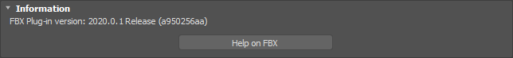
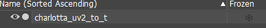
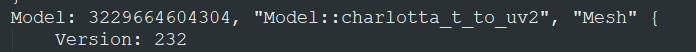

# FBXPropertyTransfer

[3ds Max](https://www.autodesk.com.tw/products/3ds-max) plugin.

When exporting or importing from [FBX](https://www.autodesk.com/products/fbx/overview), it can copy property from one to other.

In game development, it is commonly used to store extra information in vertex property. But the supported properties or channels may be different between softwares.

As follows, if we save extra information in uv(MeshMap) in 3ds Max. When exporting to FBX, it will lose some information because FBX only supported two channels in uv.

|               | Unity | FBX   | 3ds Max
|---------------|-------|-------|--------
| color         | O(3)  | O(3)  | O(3)
| normal        | O(3)  | O(4)  | O(3)
| tangent       | O(4)  | O(4)  | X
| binormal      | X     | O(4)  | X
| uv coordinate | O(4)  | O(2)  | O(3)

\* nubmer behind means channel count 

This plugin let you add some `notation` to do extra copy when exporting or importing.

So instead we can save data to tangent when exporting, and use it as tangent in Unity.

uv2(3ds Max) -> tangent(FBX) -> tangent(Unity)

## Requirements

+ 3ds Max SDK

+ FBX Extensions SDK 

+ Visual Studio

## Build

This project is built for `3ds Max 2021` with `FBX Plug-in version: 2020.0.1`.

If you have different version or inlcude & libraries path are different, please change the following path in VS.

`C/C++ -> General -> Additional Includes Directioies`

`Linker -> General -> Additional Libraries Directioies`

+ 3ds Max SDK

    SDK can be installed with 3ds Max installer.

+ FBX Extensions SDK

    check your FBX version in 3ds Max and download the right version [here](https://www.autodesk.com/developer-network/platform-technologies/fbx-sdk-archives)

    

    

## Install

1. Place `FBXPropertyTransfer.dll` in `C:\Program Files\Autodesk\3ds Max 2021\stdplugs\fbx`

2. Restart 3ds Max

## Usage

Add notation in the name of object.

```conf
rule: name_prop1_to_prop2

# Property
# vc  : vertex color
# n   : normal
# t   : tangnet
# uvx : uv coordinate(x 可為 0~7)
```

+ Export

    

    When export succeed it will show `[Export]xxx copy from xxx to xxx : Success` in MAXScript listener.

+ Import

    

    When import succeed it will show `[Import]xxx copy from xxx to xxx : Success` in MAXScript listener.

## Limitation

1. Only supporting copy one property now.
2. Unity will do normalization on normal and tangent, so the final value may be different than you thought.
3. When exporting FBX from 3ds Max, don't use triangulate. It will change the layout and faces mapping may changed.
